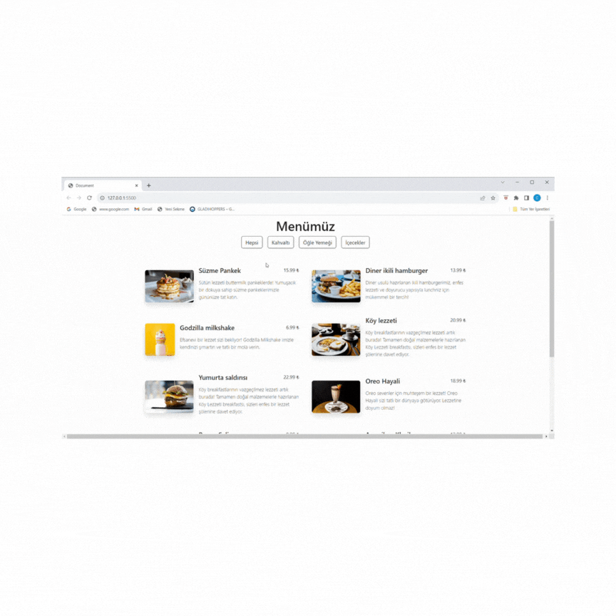

# home page
This project is a web page showing the menu of a restaurant. 
Menu items are shown separated by categories (breakfast, lunch and drinks). 
Responsive design is available. The names, images and prices of the menu items are indicated with their descriptions.

# used technologies
*HTML
*CSS
*BOOSTRAP
*JAVASCRİPT

#
outline=içi boş olan çerçeveli yapılar
export=bir yapıyı dışarıda kullanmak için çıkartmya denir
import= export edilen bir yapıyı istenilen dosyada kullanmak için import edilir.

# çok kullanılan Javascript metodları

* Join = Bir dizide elemanların arasına istediğimiz karakteri koymayı sağlar.
* filter = hedef diziyi döner ve belirtilen şart doğrultusunda yeni dizi oluşturur.

# menu-finder

